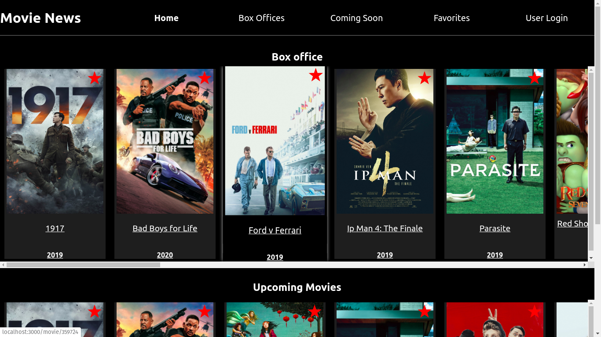
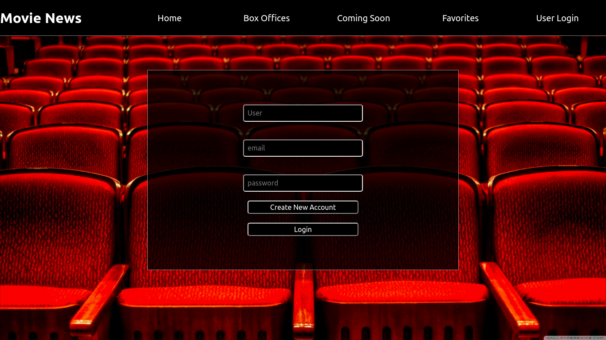
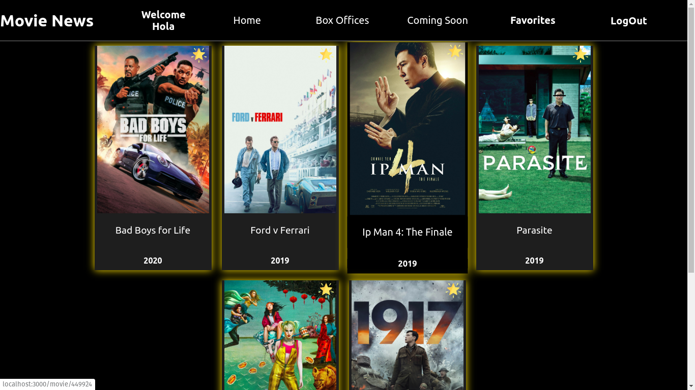
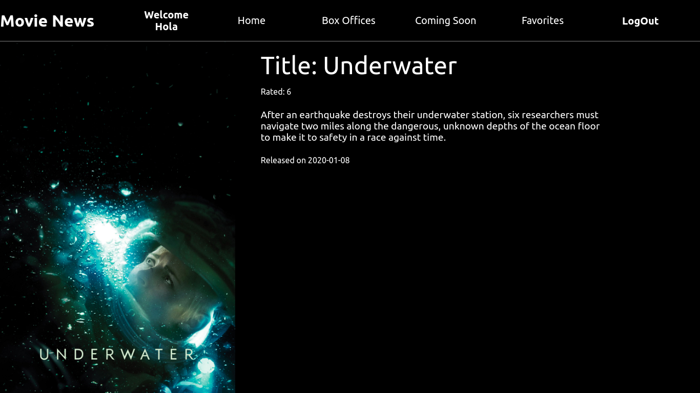

# Welcome to the _Movies News_.

## About 

If you are currious about what movies are currently out in theaters or lovers of the 7th arts. The _Movie News_ application are made for you.

_Movies News_ uses the [MOVIE DB API](https://www.themoviedb.org/) to provide the user a database of popular films currently in theaters or coming soon. Designed to practice the usage of Redux store. The application's components and Redux elements (actions & reducers) are fully tested using the Jest testing suite.

## Techniques Stacks

* React / Redux / Router

* CSS/Sass

* Jest and Enyzme testing suite

## Screenshot

#### Landing page



#### SignIn & LogOut



#### Favorites page



#### Movie page



### Set Up

This project was bootstrapped with [Create React App](https://github.com/facebook/create-react-app).

#### Clone the frontend

1. Clone the repository

```bash
git clone git@github.com:TheMindset/movies-news.git 
```
2. In the directory repository

```bash
cd movies-news/
yarn install
yarn start
```

#### Clone the backend

1. Clone the repository

```bash
git clone git@github.com:turingschool-examples/favorites-tracker-api.git 
```
2. Please follow the [Readme.md](https://github.com/turingschool-examples/favorites-tracker-api#project-setup)

### Running tests

```bash
yarn test
```